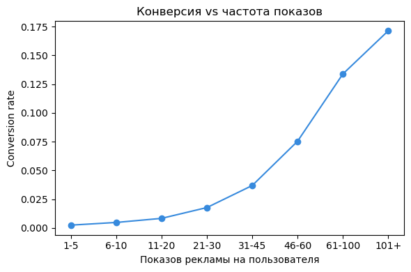

# A/B-тест: влияние рекламы на конверсию

## TL;DR

- Реклама статистически значимо повышает конверсию: 2.5547% (ad) против 1.7854% (psa), Z = 7.37, p ≈ 1.7e-13, доверительный интервал разницы не задевает ноль.
- Относительный прирост — +43.1%.
- Из этих конверсий реклама объясняет примерно 30%: остальные ~70% случились бы и без неё, за счёт базовой конверсии сайта.
- Эффекта усталости от рекламы не обнаружено — конверсия растёт монотонно с числом показов, но это похоже на обратную причинность (вовлечённость → больше показов), а не на то, что рекламу можно крутить бесконечно.

Пет-проект на открытом датасете с Kaggle (Marketing A/B Testing). Всего 588 101 пользователь сайта, разбитый на две группы: `ad` (видел рекламу) и `psa` (видел вместо рекламы нейтральное социальное объявление, по сути контрольная группа). Нужно было проверить, действительно ли реклама поднимает конверсию, и отдельно прикинуть, сколько из этих конверсий на самом деле её заслуга, а сколько случилось бы и без неё.

## Данные

Файл `Marketing_AB.csv`, 6 столбцов:

- `user id` — идентификатор пользователя
- `test group` — `ad` или `psa`
- `converted` — купил пользователь или нет
- `total ads` — сколько раз пользователю показали рекламу
- `most ads day` — день недели с наибольшим числом показов
- `most ads hour` — час с наибольшим числом показов

Пропусков нет, чистить особо нечего. Единственная особенность в том, что группы сильно разного размера: 564 577 человек в `ad` против 23 524 в `psa`. Для z-теста долей это некритично, обе выборки и так огромные.

| группа | users | conversions | rate |
|---|---|---|---|
| ad | 564 577 | 14 423 | 2.5547% |
| psa | 23 524 | 420 | 1.7854% |

## Гипотеза

H0: p_ad = p_psa — реклама не влияет на конверсию
H1: p_ad ≠ p_psa — влияет (двусторонняя альтернатива)

α = 0.05.

## Z-тест для двух долей

`statsmodels.stats.proportion.proportions_ztest`. Получено Z = 7.37, p-value = 1.71e-13, что меньше 0.05, поэтому H0 отвергается.

## Доверительные интервалы

Через `proportion_confint` (метод normal) — отдельно по каждой группе, и `confint_proportions_2indep` (метод wald) — для разницы долей:

- конверсия ad: 2.5547% (95% CI 2.5135%–2.5958%)
- конверсия psa: 1.7854% (95% CI 1.6162%–1.9546%)
- разница (ad − psa): 0.7692% (95% CI 0.5951%–0.9434%), ноль в интервал не входит
- относительный прирост: +43.1%

Реклама подняла конверсию с 1.78% до 2.55%. В процетных пунктах разница выглядит скромно, но в относительной величине это плюс 43%, и для конверсии в реальном бизнесе это уже заметно.

## Усталость от рекламы

Проверил ещё одну гипотезу: есть ли эффект насыщения, то есть падает ли конверсия после определённого числа показов, когда реклама пользователю надоедает.

Пользователей из группы `ad` разбил на диапазоны по `total ads`:

| показов на пользователя | users | conversions | rate |
|---|---|---|---|
| 1–5 | 169 962 | 427 | 0.25% |
| 6–10 | 79 537 | 386 | 0.49% |
| 11–20 | 123 334 | 1 036 | 0.84% |
| 21–30 | 66 150 | 1 177 | 1.78% |
| 31–45 | 49 128 | 1 815 | 3.69% |
| 46–60 | 25 342 | 1 911 | 7.54% |
| 61–100 | 29 070 | 3 892 | 13.39% |
| 101+ | 22 054 | 3 779 | 17.14% |

Усталости нет вообще. Конверсия растёт монотонно, причём с ускорением. Но выводить из этого "чем больше рекламы, тем лучше" я бы не стал. Скорее здесь работает обратная причинность: чем дольше человек находится на сайте, тем больше баннеров он успевает увидеть и тем выше у него в принципе шанс что-то купить. Число показов тут не причина конверсии, а следствие вовлечённости, которую я напрямую не измеряю. Это классическая проблема пропущенной переменной.

К тому же датасет синтетический, поэтому эта часть моего проекта скорее демонстрирует ограничение интерпретации таких данных, чем позволяет сделать вывод об эффекте частоты показов.

## Оценка чистого эффекта рекламы

В группе psa конверсия без всякой рекламы держится на уровне 1.7854%. Если предположить, что без рекламы в группе ad конверсия была бы такой же, можно прикинуть, сколько покупок случилось бы там и без неё:
